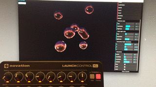

# dat.GUI.midi

## What is this?

This is an _experimental_ fork of [dat.GUI](https://github.com/dataarts/dat.gui) to add support for MIDI controllers to all existing dat.GUI applications.

## How to use it?

Replace the `dat.gui.*.js` file you're using (`dat.gui.min.js`, `dat.gui.module.js`, etc.) by the one found in this repository under `build/`.

Then, after initializing the GUI, add the MIDI functionality:

    var gui = new dat.gui.GUI();
    gui.enableMidi();

## Features

- Automapping mode allowing to quickly link a MIDI controller to a dat.GUI parameter
- Support for simultaneous MIDI devices
- Support for almost all dat.GUI controller types (boolean, color, function, number and option)
- Support for loading/saving MIDI mappings via the JSON output
- Support for saving MIDI mappings to localStorage

## Future

- Better/different support for color controllers (beyond hue control)
- Automated testing with mock MIDI interfaces/messages..?
- Add gif/demo of automapping feature into readme
- Refactor code into separate class
- Consider opening a PR / merging into dat.GUI repo (if there's interest)
- Fork dat.gui so that this repo is connected to the upstream one

## Tested MIDI devices

- Novation Launch Control XL
- Teenage Engineering OP-1
- (successfully tested with your device? let me know / open a PR! thank you)

## Development instructions

Follow the [dat.GUI instructions](https://github.com/dataarts/dat.gui#building-your-own-datgui) i.e., `npm install`, `npm run dev`, etc.

## Credits

- all dat.GUI contributors
- all Three.js contributors
- Henrik Rydgård for the Marching Cubes example
